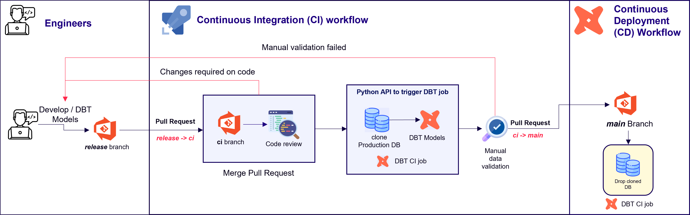

# CI Process

## Purpose

- Purpose of Continuous Integration (CI) are to find and fix bugs faster, improve deliverables, and shorten the time it takes to validate new releases to Production environment

- Having a consistent integration process encourages developers to commit code changes more frequently, which leads to better collaboration and code quality

- Reduced risk: Frequent & minor releases allows platform to be up-to date & be agile and creates the trust for consumers

## Detailed System Design

- After the UAT sign off, Data engineering team creates Pull Request (PR) to merge code from release-x.x.x branch to ci branch

- Reviewer does peer review the code and DBT models

- Reviewer approves the changes if he/she happy with changes

- If reviewer has feedback to update before merge - then reviewer adds feedbacks in Azure Repository as comments. Steps 1 - 3 repeats until reviewer is happy

- After reviewer approved the PR, then Pipeline runs Job to setup Ubuntu instance to trigger the DBT CI Job to do following steps to make sure build does not break anything when we merge into production

    - Clone the Production Database

    - Run the DBT models

    - Run the Unit tests

- After the successful run of DBT CI Job - code can be merged into main branch to deploy to production

  

